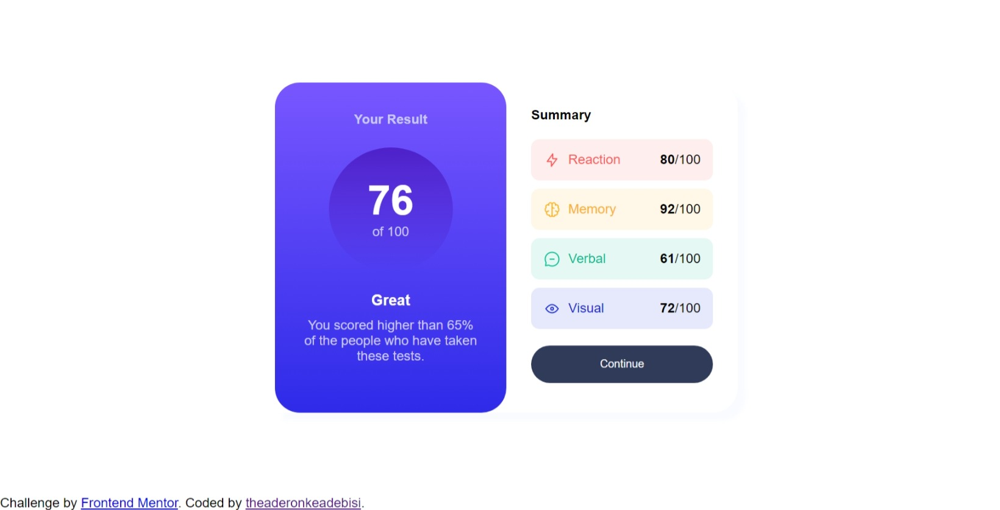
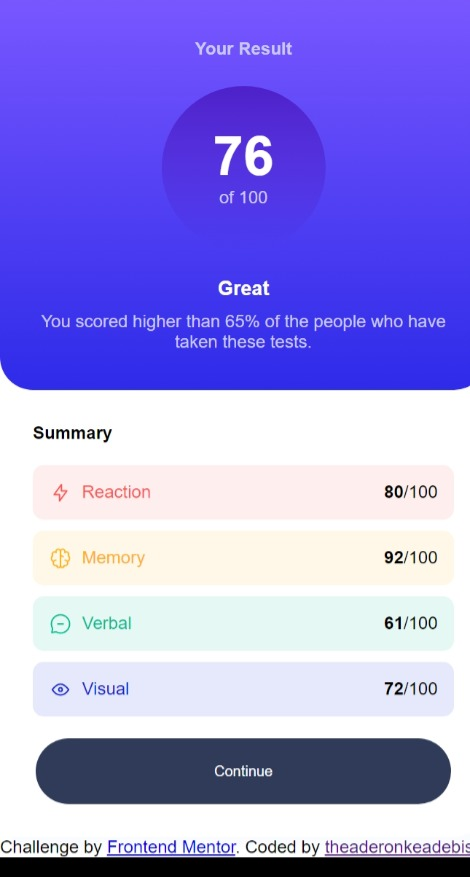

# Frontend Mentor - Results summary component solution

This is a solution to the [Results summary component challenge on Frontend Mentor](https://www.frontendmentor.io/challenges/results-summary-component-CE_K6s0maV). Frontend Mentor challenges help you improve your coding skills by building realistic projects. 

## Table of contents

- [Overview](#overview)
  - [The challenge](#the-challenge)
  - [Screenshot](#screenshot)
  - [Links](#links)
- [My process](#my-process)
  - [Built with](#built-with)
  - [What I learned](#what-i-learned)
  - [Continued development](#continued-development)
  - [Useful resources](#useful-resources)
- [Author](#author)

## Overview

### The challenge

Users should be able to:

- View the optimal layout for the interface depending on their device's screen size
- See hover and focus states for all interactive elements on the page

### Screenshot




### Links

- Solution URL: [https://github.com/theaderonkeadebisi/Result-Summary-Components.git](https://github.com/theaderonkeadebisi/Result-Summary-Components.git)
- Live Site URL: [https://theaderonkeadebisi.github.io/Result-Summary-Components/](https://theaderonkeadebisi.github.io/Result-Summary-Components/)

## My process

### Built with

- Semantic HTML5 markup
- CSS3 properties
- Flexbox
- Desktop-first 
- [Styled Components](https://fonts.google.com/specimen/Hanken+Grotesk) - For styles


### What I learned

```html
<p><strong>92</strong>/100</p> 
I used strong for my scores instead of using the span element and assigning a class afterwards just to add an effect to a value like I would normally do.
```

### Continued development

I would like to be more intentional about implementing semantic HTML. I would also like to be more comfortable with CSS selectors.
I feel like I try not to use too many divs but i end up using too many divs. I don't know when it's unnecessary to use it.

### Useful resources

- [W3Schools](https://www.w3schools.com) - This helped me when I had issues with remembering flex-box properties, linear-gradient and how to import the font-family.

## Author
- Frontend Mentor - [@Adebisi0](https://www.frontendmentor.io/profile/Adebisi0)
- Twitter - [@ajadebisi](https://www.twitter.com/ajadebisi)

